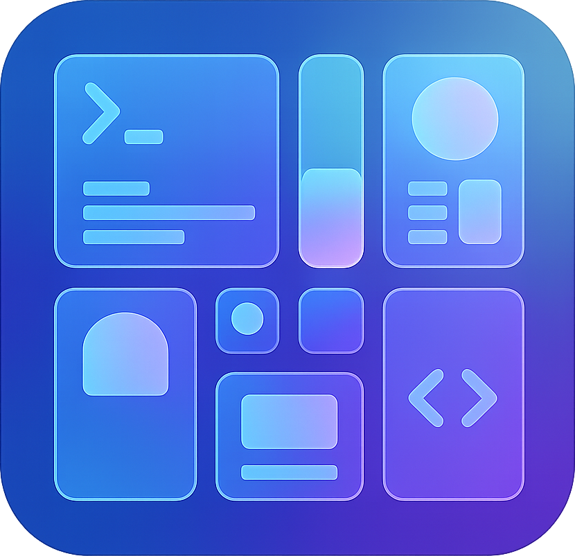
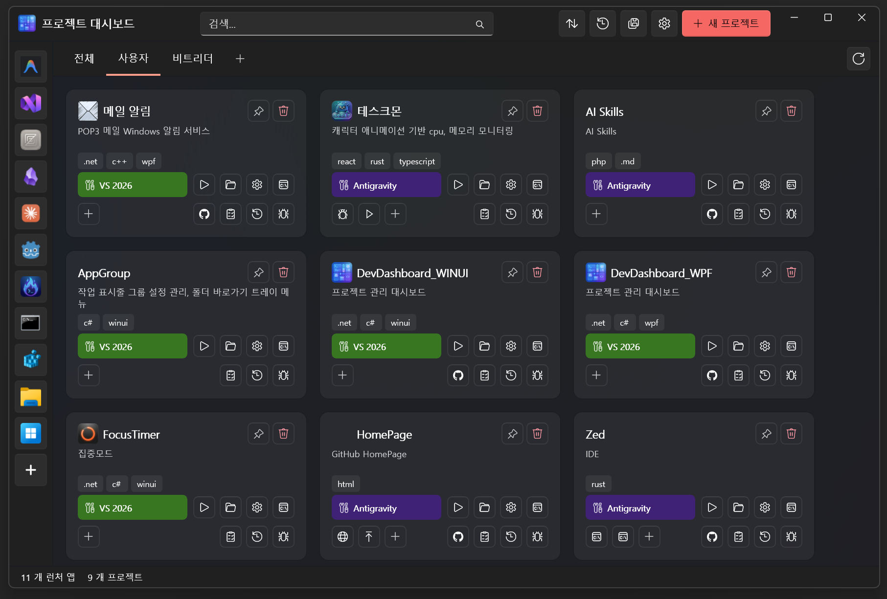
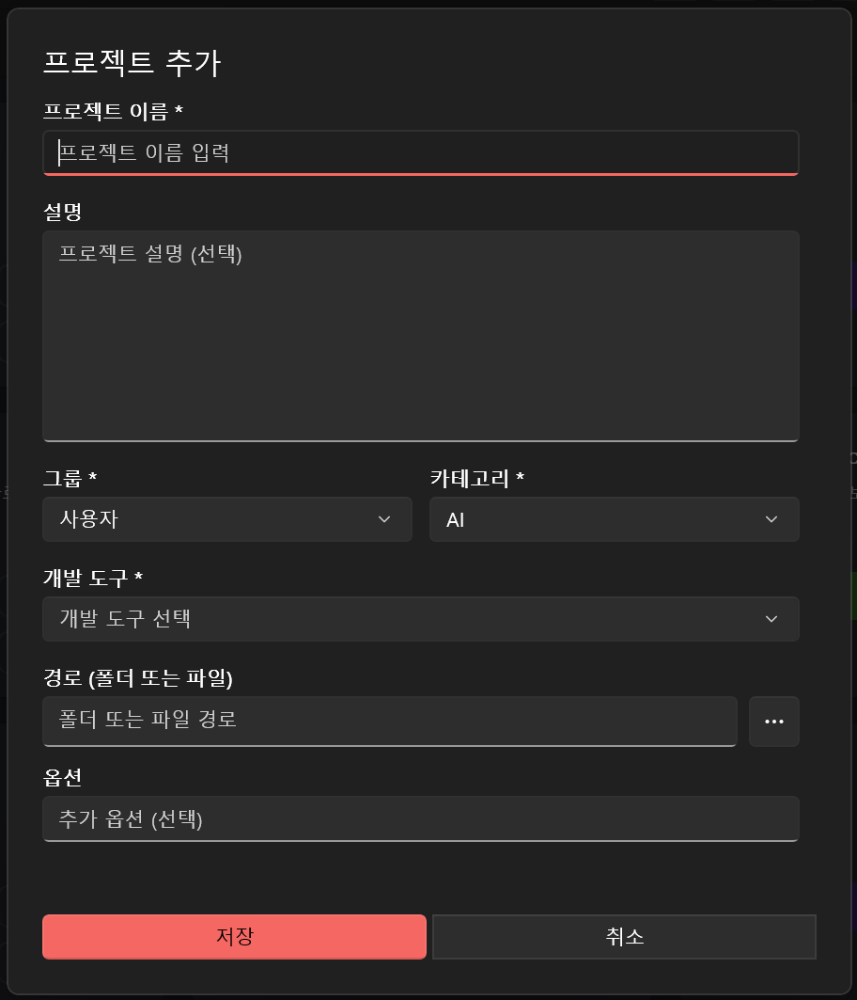
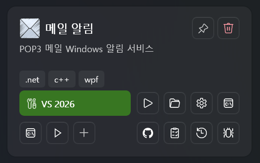
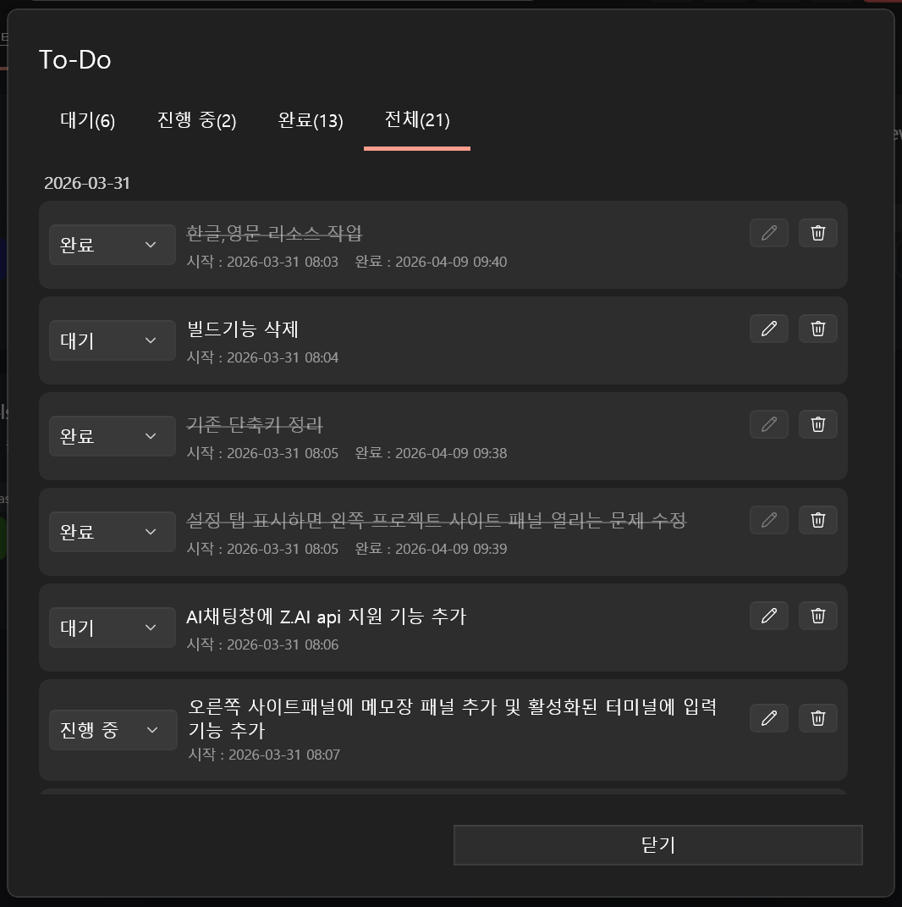
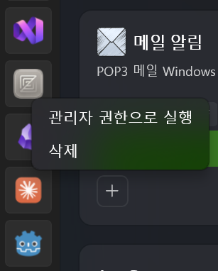
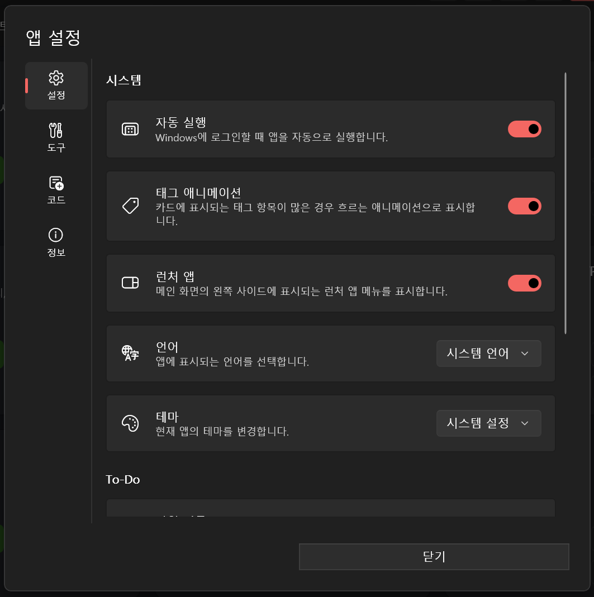

<p align="center">
  
</p>

<h1 align="center">DevDashboard</h1>

<p align="center">
여러 개발 프로젝트를 카드 형태로 한눈에 관리하고, 즐겨 쓰는 IDE·셸·앱을 클릭 한 번으로 실행할 수 있는 Windows 데스크톱 대시보드입니다.<br/>
WinUI 3 · Windows App SDK 1.8 · .NET 10 · MVVM(CommunityToolkit.Mvvm) · SQLite 기반으로 만들어졌습니다.
</p>

## 주요 기능

### 프로젝트 카드 대시보드
- 프로젝트별 카드 등록 (이름·설명·아이콘·경로·기술 스택 태그·카테고리)
- **그룹 탭**으로 프로젝트 분류 (추가 / 이름 변경 / 삭제 / 좌우 스크롤)
- 헤더 검색창으로 카드 즉시 필터링
- 정렬 기준 선택: 이름순 / 카테고리순 / 최근 등록순
- 카드 드래그&드롭 정렬 + 상단 핀 고정
- 새로고침 / Hard 새로고침으로 Git 상태 즉시 갱신

### 프로젝트 실행 액션
- 설치된 IDE 자동 감지(`DevToolDetector`) — Visual Studio, VS Code 등으로 즉시 열기
- 사용자 정의 외부 도구 등록 가능
- PowerShell / CMD 셸 명령 실행, 작업 폴더 지정
- 관리자 권한 실행 옵션
- 카드별 **커맨드 스크립트 슬롯 4개** — 셸 타입·아이콘·작업 폴더·완료 후 자동 종료 설정
- Git 상태 다이얼로그로 변경 파일 확인

### To-Do · 테스트 · 작업 기록
- **To-Do**: 3상태(대기 / 진행 중 / 완료) ComboBox, 4탭 필터(개수 표시), 진행→완료 시 작업 기록 팝업 옵션
- **테스트 목록**: 카테고리 기반 구조, 3상태(테스트 / 수정 / 완료), 진행 내용(`ProgressNote`) 편집, 날짜 그룹화
- **작업 기록**: 프로젝트별 + 전체 작업 기록 통합 보기

### 런처 사이드바
- 좌측 상주 사이드바에 자주 쓰는 앱 아이콘 등록
- 설치된 앱 검색(`InstalledAppsDialog`) 또는 직접 `.exe` 등록
- 아이콘 자동 추출 + 캐싱 (최대 500개)
- 드래그 정렬, 좌클릭 실행, 우클릭(관리자 권한 / 삭제) 메뉴
- 중복 실행 방지 + 800 ms 쿨다운, 백그라운드 실행으로 UI 프리징 방지
- 사이드바 표시/숨김 토글

### 데이터 · 설정
- 전체 데이터 **내보내기 / 가져오기** (`VACUUM INTO` 스냅샷, 가져오기 시 중복 체크 + 아이콘 추출 병렬화)
- 데이터 초기화: 전체 / 프로젝트만 / 런처만 분리 삭제
- **다국어**: 시스템 기본 / 한국어 / English (재시작 후 반영)
- **테마**: 시스템 기본 / 다크 / 라이트 (즉시 적용)
- 태그 마키 애니메이션 ON/OFF (포인터 호버 시에만 재생되어 CPU/GPU 절약)
- GitHub Releases 기반 새 버전 확인 및 하단 배너 알림
- 단일 인스턴스 보장 (`AppInstance` + Mutex)

## 시스템 요구 사항

- Windows 10 (1809 이상) 또는 Windows 11
- .NET 10 Desktop Runtime (자체 포함 빌드를 사용하는 경우 별도 설치 불필요)
- x86 / x64 / ARM64 아키텍처 지원

## 설치

### 릴리스에서 설치

1. [Releases](https://github.com/jongcheol-pak/DevDashboard_WinUI/releases) 페이지에서 최신 버전을 내려받습니다.
2. 압축을 해제한 뒤 `DevDashboard.exe`를 실행합니다.

### 소스에서 빌드

```powershell
git clone https://github.com/jongcheol-pak/DevDashboard_WinUI.git
cd DevDashboard_WinUI
msbuild DevDashboard_WinUI/DevDashboard.csproj -t:Build -p:Configuration=Release -p:Platform=x64
```

> WinUI 3 프로젝트 특성상 **플랫폼 지정(`-p:Platform=x64`)이 필수**입니다. AnyCPU로 빌드하면 MSIX 패키지 오류가 발생합니다. ARM64 / x86 환경에서는 해당 값으로 변경해 주세요.

빌드 결과물은 `DevDashboard_WinUI/bin/{Platform}/{Configuration}/net10.0-windows10.0.26100.0/` 아래에 생성됩니다 (예: `bin/x64/Release/...` 또는 `bin/x64/Debug/...`).

## 사용 방법

앱을 실행하면 메인 창이 열리며, 좌측 런처 사이드바·상단 그룹 탭·중앙 카드 그리드로 구성된 대시보드가 표시됩니다.



### 1. 프로젝트 카드 등록

1. 헤더 우측 **새 프로젝트** 버튼을 누릅니다.
2. 프로젝트 설정 다이얼로그에서 정보를 입력합니다.
   - **이름 / 설명 / 아이콘**: 카드에 표시될 정보
   - **경로**: 프로젝트 루트 디렉터리
   - **개발 도구 / 옵션**: 카드 클릭 시 열릴 IDE와 추가 인수
   - **셸 명령**: PowerShell·CMD에서 실행할 명령어 및 작업 폴더
   - **태그 / 카테고리**: 검색·정렬에 사용
   - **커맨드 스크립트 슬롯**: 카드에 표시될 최대 4개의 빠른 실행 버튼

   

3. 등록된 카드는 클릭으로 IDE 실행, 우클릭 메뉴로 핀 고정·복제·삭제·관리자 권한 실행이 가능합니다.

   

### 2. To-Do · 테스트 관리

카드의 To-Do/테스트 아이콘을 클릭하면 해당 다이얼로그가 열립니다. 항목별로 **대기 / 진행 / 완료** 상태를 ComboBox로 변경할 수 있고, 상단 4개 탭으로 빠르게 필터링할 수 있습니다. 진행 중 To-Do를 완료로 바꾸면 설정에 따라 작업 기록 팝업이 자동으로 표시됩니다.



### 3. 런처 사이드바

좌측 사이드바 하단의 **+** 버튼으로 자주 쓰는 앱을 등록할 수 있습니다.

- **설치 앱 검색**으로 시작 메뉴에 등록된 앱을 빠르게 추가
- **직접 추가**로 임의의 `.exe` 파일 지정
- 아이콘은 자동 추출되어 캐시됩니다
- 드래그&드롭으로 순서 변경, 우클릭 메뉴로 관리자 권한 실행 / 삭제



### 4. 앱 설정

헤더의 톱니바퀴 아이콘으로 앱 설정 다이얼로그를 엽니다. 변경 즉시 또는 닫기 시 자동 저장됩니다.



- **테마**: 시스템 기본 / 다크 / 라이트
- **언어**: 시스템 기본 / 한국어 / English (재시작 후 반영)
- **외부 개발 도구**: IDE를 사용자 정의로 추가
- **카테고리 / 기술 스택 태그**: 카드에서 사용할 분류 항목 관리
- **태그 마키 애니메이션**: 카드 태그 슬라이딩 효과 ON/OFF
- **런처 사이드바 표시**: 좌측 사이드바 표시 여부
- **작업 기록 팝업**: To-Do 완료 시 작업 기록 입력 팝업 자동 표시
- **데이터 내보내기 / 가져오기**: DB 스냅샷을 단일 파일로 백업 / 복원
- **초기화**: 전체 / 프로젝트만 / 런처만 분리 삭제

## 설정 파일 위치

| 항목 | 경로 |
|---|---|
| 프로젝트 DB | `%LocalAppData%\Packages\<PackageFamilyName>\LocalState\projects.db` |
| 앱 설정 | `ApplicationData.Current.LocalSettings` (`AppSettings` 키, JSON 직렬화) |
| 런처 아이콘 캐시 (PNG) | `%LocalAppData%\Packages\<PackageFamilyName>\LocalState\LauncherIcons\` |
| 런처 아이콘 캐시 인덱스 | `%LocalAppData%\Packages\<PackageFamilyName>\LocalState\launcher_icon_cache.json` (LRU 500개 제한, 초과 시 가장 오래된 20% 제거) |

> MSIX 패키지 형식으로 배포되므로 사용자 데이터는 패키지 격리 폴더(`%LocalAppData%\Packages\...`)에 저장됩니다.

## 주요 의존성

- [Microsoft.WindowsAppSDK](https://learn.microsoft.com/windows/apps/windows-app-sdk/) — WinUI 3 / Windows App SDK 1.8
- [CommunityToolkit.Mvvm](https://github.com/CommunityToolkit/dotnet) — MVVM 프레임워크 (RelayCommand, ObservableProperty)
- [CommunityToolkit.WinUI.Controls](https://github.com/CommunityToolkit/Windows) — 추가 WinUI 컨트롤 (Settings, Primitives)
- [Microsoft.Data.Sqlite](https://learn.microsoft.com/dotnet/standard/data/sqlite/) — 로컬 데이터베이스
- [WinUIEx](https://github.com/dotMorten/WinUIEx) — `WindowEx`, Mica 백드롭 등 확장 기능
- [System.Drawing.Common](https://learn.microsoft.com/dotnet/api/system.drawing) — 런처 아이콘 추출

## 알려진 제한 사항

- WinUI 3 / Windows App SDK 특성상 **Windows 10 1809 (빌드 17763) 이상**에서만 동작합니다.
- 빌드 시 `Platform`을 명시(x64 / x86 / ARM64)해야 하며 AnyCPU는 지원되지 않습니다.
- 언어 설정 변경은 앱 재시작 후 반영됩니다 (런타임 스위칭 미지원).
- 카드별 커맨드 스크립트는 최대 4개 슬롯까지 등록 가능합니다.

## 라이선스

[MIT License](LICENSE) 하에 배포됩니다.

Copyright © 2026 JongCheol Pak ([@jongcheol-pak](https://github.com/jongcheol-pak))
